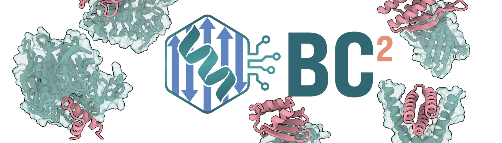

.. BindCraf2 documentation master file, created by
   sphinx-quickstart on Wed Sep 16 20:47:01 2026.
   You can adapt this file completely to your liking, but it should at least
   contain the root `toctree` directive.

BindCraf2 documentation
=======================

BindCraft2 (BC2) combines AlphaFold 2, ProteinMPNN, and structural filtering to design protein binders, generate predicted complexes, and rank candidate designs. Its flexible workflow supports the creation of  de novo miniproteins, scaffolded binders, cyclic peptides, antibody formats, and conformational design.

Explore the documentation below to learn how BindCraft2 works, choose the right design approach for your project, and get started with your own designs.

.. raw:: html

   

     <a class="bc2-cta-button" href="design-guide.html">Read the design guide</a>
   

   

.. toctree::
   :maxdepth: 2
   :caption: Contents:

